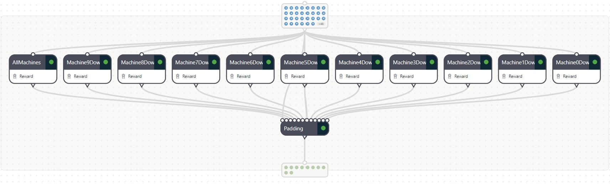
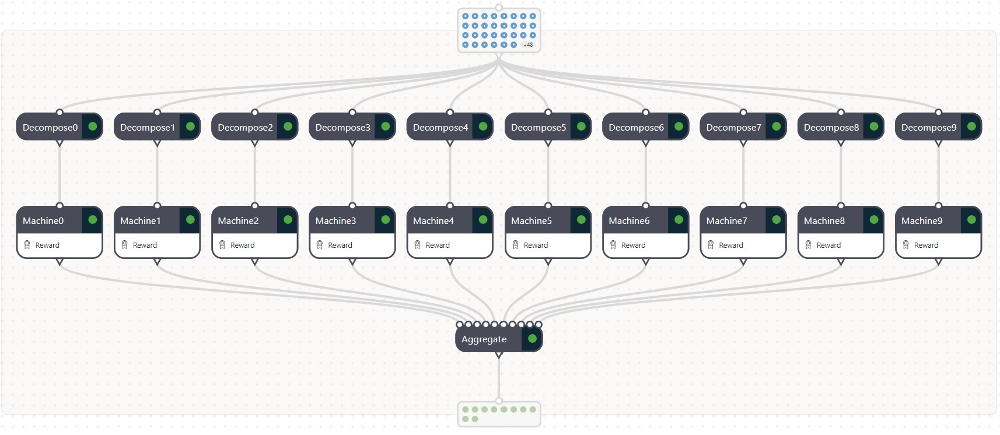
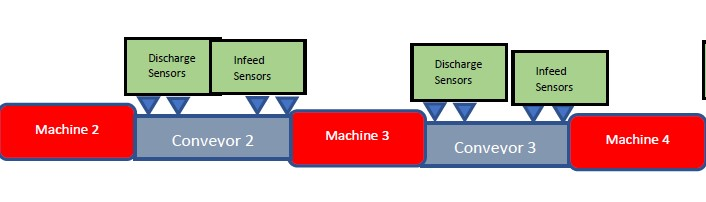
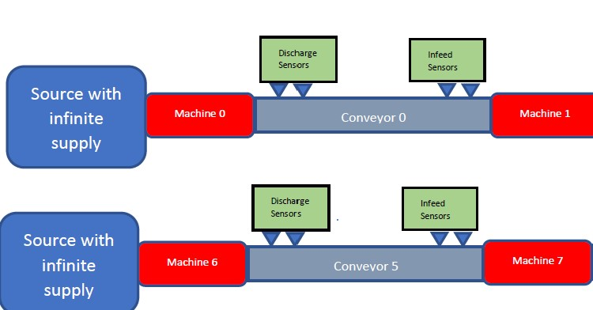
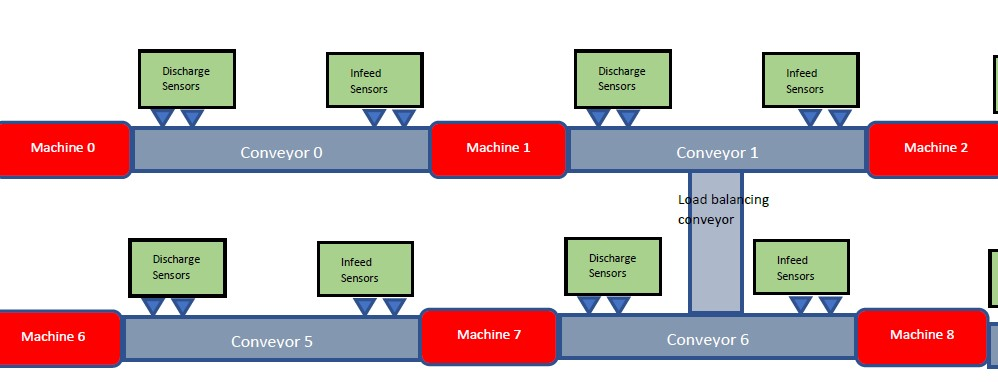
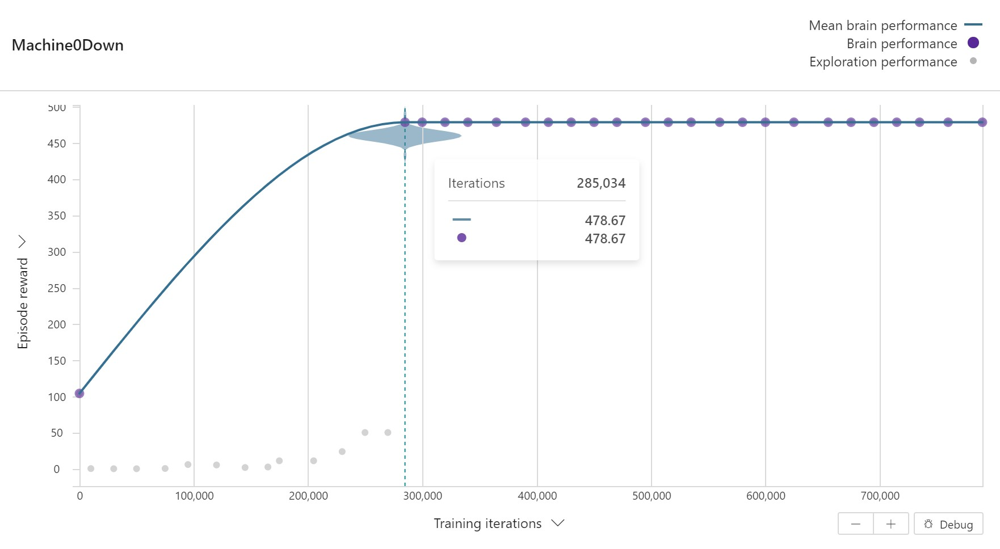
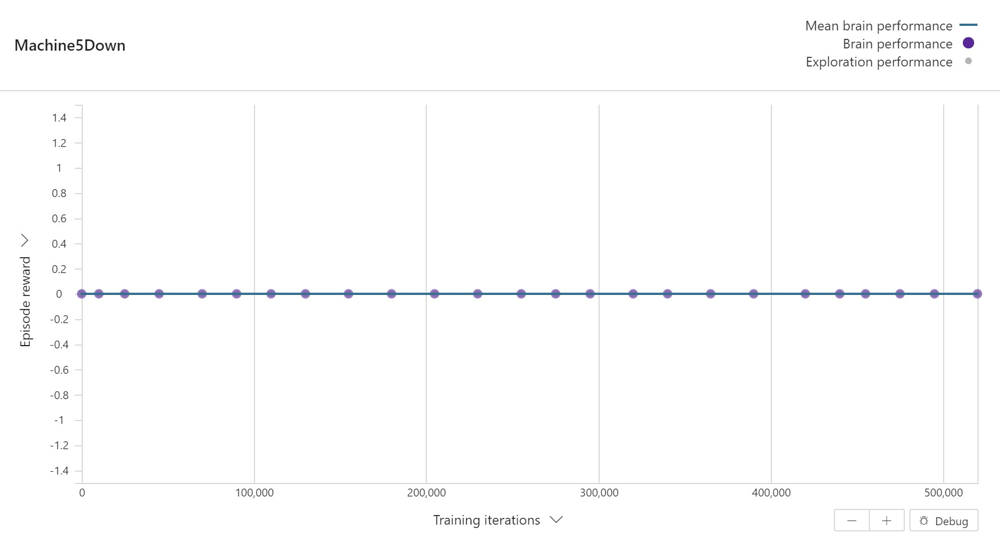
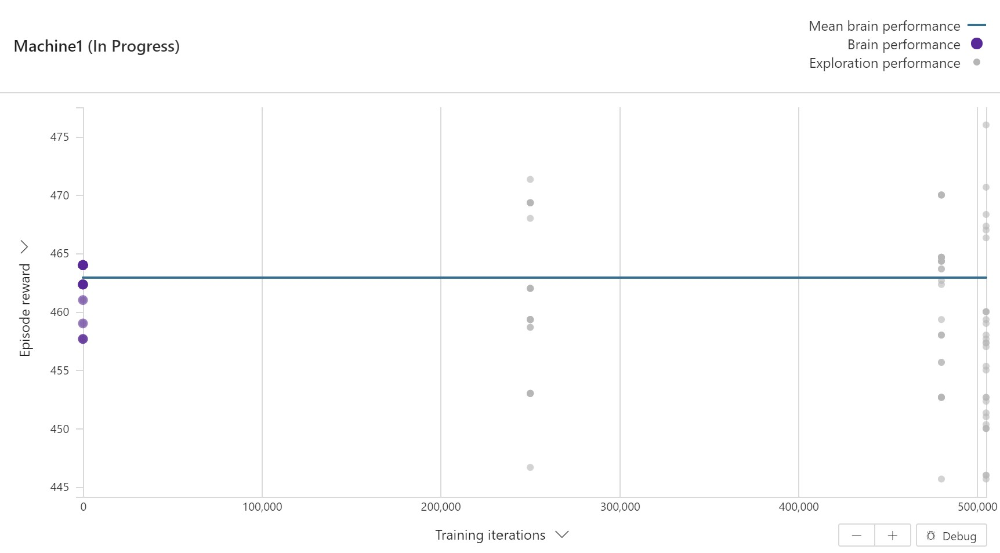

# Manufacturing Line Optimization

## Bussiness problem

Train brain to control machine speed of a manufacturing line for maximum throughput while random machines could go offline.


## Objectives

Maximize production in a manufacturing line.  

|                        | Definition                                                   | Notes |
| ---------------------- | ------------------------------------------------------------ | ----- |
| Objective              | maximize product production     |   Example: For a can manufacturing line, the goal is to maximize can production                        |
| Constraints            |   NA |
| Observations           | Conveyors speed, machines speed, machines_state infeed and discharge proxes, sink_machines_rate, sink_throughput_delta_sum, illegal_machine_actions, illegal_conveyor_actions, remaining_downtime_machines, control_delta_t | Proxes are sensors that yield a binary value. When product accumulates on the conveyor and covers the location of the prox sensor, its value becomes 1, otherwise it's value is zero, illegal actions happen with machines are in down or idle mode but brain sends a nonzero action, which will be ignored by the simulator but will return a flag to inform brain, remaining_downtime informs brain about remaining downtime for each machine. Active or idle machines yield zero for the their remaining downtime. sink_throughput_delta_sum is the amount of productions(throughput) between control actions, machine state -1 means down, 0 means idle, 1 means active |
| Actions                |  Machine Speeds | Speeds are processed in cans/min units|
| Control Frequency      | Fixed 3 min, episode length of 480 | Fixed, event driven, or mix of both fixed and event driven control  |
| Episode configurations | control_type (fixed, event driven, or mix of both), control_frequency (for fixed and mix), inter_downtime_event_mean (average time between downtime events),inter_downtime_event_dev, downtime_event_duration_mean, downtime_event_duration_dev, number_parallel_downtime_events, layout_configuration, down_machine_index | Note: currently only one default layout is supported. down_machine_index can be anywhere from 0-9 or -1 for random |

## Solution approach(es)

```
approach 1: fixed time control frequency with illegal actions. 
approach 2: event driven with no illegal actions.
approach 3: multi concept, equipment down concepts 
approach 4: multi concept, state/action space reduction 
```

### High level solution architecture

#### Approach 3: Multi Concept, equipment down concepts



Each concept learns on an isolated configuration where a specific machine is down. The action type has `n-1` machine speeds to control and a programmed concept pads the missing machine speed with a zero based on the machine state.

```javascript

    if s.machines_state[9] == -1 {
        return {
            machines_speed: [
                m9down.machines_speed[0],
                m9down.machines_speed[1],
                m9down.machines_speed[2],
                m9down.machines_speed[3],
                m9down.machines_speed[4],
                m9down.machines_speed[5],
                m9down.machines_speed[6],
                m9down.machines_speed[7],
                m9down.machines_speed[8],
                0,
            ],
        }
    }
    
    else if s.machines_state[8] == -1 {
        return {
            machines_speed: [
                m8down.machines_speed[0],
                m8down.machines_speed[1],
                m8down.machines_speed[2],
                m8down.machines_speed[3],
                m8down.machines_speed[4],
                m8down.machines_speed[5],
                m8down.machines_speed[6],
                m8down.machines_speed[7],
                0,
                m8down.machines_speed[8],
            ],
        }
    }

```

The downside of this approach is that it is not easily scalable to higher dimension spaces. If more than one machine is down at a single time, then the number of concepts that must be trained becomes combinatorial.

#### Approach 4: Multi Concept, state/action space reduction



Each concept focuses on observations and actions related to a specific machine category such as "Source/Sink", "Connected", "In/Out". The state and action space dimensions get reduced per concept because we think about what goes in and out of the machine, with any additional machines connected via conveyors through either a load balancer or joiner.

> Maybe in the future, concepts could be re-used and imported because the categories all look 'similar'. Today they need to be re-trained.

##### In/Out



Machine 3 is an example of a typical machine with one input and one output, where machines are connected on both sides of the machine with a conveyor belt.

```javascript
function decompose3(s: ObservationState): MachineState {
    return {
        machines_speed: [
            s.machines_speed[2],
            s.machines_speed[3],
            s.machines_speed[4]
        ], 
        machines_state: [
            s.machines_state[2],
            s.machines_state[3],
            s.machines_state[4]
        ],
        sink_machines_rate_sum: s.sink_machines_rate_sum,
        sink_throughput_delta_sum: s.sink_throughput_delta_sum,
        conveyor_infeed_m1_prox_empty: [
            s.conveyor_infeed_m1_prox_empty[2],
            s.conveyor_infeed_m1_prox_empty[3]
        ],
        conveyor_infeed_m2_prox_empty: [
            s.conveyor_infeed_m2_prox_empty[2], 
            s.conveyor_infeed_m1_prox_empty[3]
        ],
        conveyor_discharge_p1_prox_full: [
            s.conveyor_discharge_p1_prox_full[2], 
            s.conveyor_discharge_p1_prox_full[3]
        ],
        conveyor_discharge_p2_prox_full: [
            s.conveyor_discharge_p2_prox_full[2],
            s.conveyor_discharge_p2_prox_full[3]
        ], 
        illegal_machine_actions: [
            s.illegal_machine_actions[2],
            s.illegal_machine_actions[3],
            s.illegal_machine_actions[4]
        ],
        remaining_downtime_machines: [
            s.illegal_machine_actions[2],
            s.illegal_machine_actions[3],
            s.illegal_machine_actions[4]
        ]
    }
}
```

##### Source/Sink



Machine 0 and Machine 6 are examples of machines near a Source, where information relevant to them are really only the current machine and the machine connected to it as output.

```javascript
function decompose0(s: ObservationState): MachineStateSourceSink {
    return {
        machines_speed: [
            s.machines_speed[0],
            s.machines_speed[1]
        ], 
        machines_state: [
            s.machines_state[0],
            s.machines_state[1]
        ],
        sink_machines_rate_sum: s.sink_machines_rate_sum,
        sink_throughput_delta_sum: s.sink_throughput_delta_sum,
        conveyor_infeed_m1_prox_empty: [
            s.conveyor_infeed_m1_prox_empty[0],
        ],
        conveyor_infeed_m2_prox_empty: [
            s.conveyor_infeed_m2_prox_empty[0], 
        ],
        conveyor_discharge_p1_prox_full: [
            s.conveyor_discharge_p1_prox_full[0], 
        ],
        conveyor_discharge_p2_prox_full: [
            s.conveyor_discharge_p2_prox_full[0],
        ], 
        illegal_machine_actions: [
            s.illegal_machine_actions[0],
            s.illegal_machine_actions[1]
        ],
        remaining_downtime_machines: [
            s.illegal_machine_actions[0],
            s.illegal_machine_actions[1]
        ]
    }
}
```

##### Connected



Certain machines can be connected as a 'joiner' or 'load balancer' where it may be beneficial to divert the flow to a different line for various reasons. There are buffer capacities of the conveyors and it is useful for a concept to know what the other conveyors are doing in order to adjust machine speeds. 

```javascript
function decompose7(s: ObservationState): MachineStateConnect {
    return {
        machines_speed: [
            s.machines_speed[6],
            s.machines_speed[7],
            s.machines_speed[8],
            s.machines_speed[1],
        ], 
        machines_state: [
            s.machines_state[6],
            s.machines_state[7],
            s.machines_state[8],
            s.machines_state[1],
        ],
        sink_machines_rate_sum: s.sink_machines_rate_sum,
        sink_throughput_delta_sum: s.sink_throughput_delta_sum,
        conveyor_infeed_m1_prox_empty: [
            s.conveyor_infeed_m1_prox_empty[5],
            s.conveyor_infeed_m1_prox_empty[6],
            s.conveyor_infeed_m1_prox_empty[1]
        ],
        conveyor_infeed_m2_prox_empty: [
            s.conveyor_infeed_m2_prox_empty[5], 
            s.conveyor_infeed_m1_prox_empty[6],
            s.conveyor_infeed_m1_prox_empty[1]
        ],
        conveyor_discharge_p1_prox_full: [
            s.conveyor_discharge_p1_prox_full[5], 
            s.conveyor_discharge_p1_prox_full[6],
            s.conveyor_discharge_p1_prox_full[1]
        ],
        conveyor_discharge_p2_prox_full: [
            s.conveyor_discharge_p2_prox_full[5],
            s.conveyor_discharge_p2_prox_full[6],
            s.conveyor_discharge_p2_prox_full[1]
        ], 
        illegal_machine_actions: [
            s.illegal_machine_actions[6],
            s.illegal_machine_actions[7],
            s.illegal_machine_actions[8],
            s.illegal_machine_actions[1],
        ],
        remaining_downtime_machines: [
            s.illegal_machine_actions[6],
            s.illegal_machine_actions[7],
            s.illegal_machine_actions[8],
            s.illegal_machine_actions[1]
        ]
    }
}
```

##### Action transform to isolate training concepts one at a time

Since multi-concept requires training concepts one at a time, if we are decomposing the actions to per machine, then some heuristic will need to provide the actions for the other machines. A simple heuristic is what we used for the benchmark: max speed of 100.

An action transform can be used in Inkling, however we're currently limited to static values. If more advanced heuristics are desired, then it is recommended to apply them on the simulator side.

```javascript
function ExpertActionExceptMachine9(a: MachineAction): SimAction {
    return {
        machines_speed: [
            100,
            100,
            100,
            100,
            100,
            100,
            100,
            100,
            100,
            a.machines_speed,
        ]
    }
}


```

## Benchmark

Considering the main objective is to maximize throughput, a basic heuristic could be to run the machine speeds at maximum despite machines going down for service. This is an unintelligent strategy, however, it gives us a baseline of whether or not a brain is learning.

```python
def max_policy(state):
    """
    Ignore the state, run at max speed.
    """
    action = {
        "machines_speed": [100 for i in range(10)], 
    }
    return action
```
> The amt of downtime below is the sum of the machine states, so higher is better 

| Experiment | sink_throughput_absolute_sum | env_time | amt of downtime |
| ----- | ----- | ----- | ----- |
| all machines up with fixed control freq | 143600 | 1437 | 2920 |
| 1 random machine down with fixed control freq | 139200 | 1437 | 2698 |

## Brain experimental card

|                        | Definition                                                   | Notes |
| ---------------------- | ------------------------------------------------------------ | ----- |
| State                  |   machines_speed    |    previous machine speed          |
| State                  |   machines_state    |       -1 down, 0 idle, 1 active       |
| State                  |    sink_machines_rate_sum   |  10 all machines active, -10 all machines down       |
| State                  |    sink_throughput_delta_sum   |       incremental throughput on state transition       |
| State                  |    conveyor_infeed_m1_prox_empty[9]   |       first sensor infeed       |
| State                  |    conveyor_infeed_m2_proxy_empty[9]   |      second sensor infeed        |
| State                  |    conveyor_discharge_p1_prox_full[9]   |       first sensor discharge       |
| State                  |    conveyor_discharge_p2_prox_full[9]   |      second sensor discharge        |
| State                  |    illegal_machine_actions[10]   |      1 action illegal, 0 fine        |
| State                  |    remaining_downtime_machines[10]   |      remaining time for each machine        |
| Terminal               | None |   N/A    |
| Action                 |   machines_speed[10]   |   number<0,10,20,30,100,>[10] cans/min    |
| Reward or Goal         |   sink_throughput_delta_sum/(100*control_delta_t)    |   Incremental throughput cans/min  |
| Episode configurations |       control freq = 3 min, control_type = 0, down_machine_index = -1      |    down_machine_index = -1 means random, other specify [0, 9]   |

## Results

### Approach 3: Multi Concept, equipment down concepts

Typical training curve of concepts


Machine 5 is different because if this machine is down, then no throughput is allowed since it is right before the sink.


| Experiment | sink_throughput_absolute_sum | env_time | amt of downtime |
| ----- | ----- | ----- | ----- |
| all actions 100, 1 random machine down with fixed control freq | 139200 | 1437 | 2698 |
| multi-concept brain, decomposed | 106780 | 1437 | 2830 |


### Approach 4: Multi Concept, state/action space reduction

Typical training curve so far has been flat for all concepts


| Experiment | sink_throughput_absolute_sum | env_time | amt of downtime |
| ----- | ----- | ----- | ----- |
| all actions 100, 1 random machine down with fixed control freq | 139200 | 1437 | 2698 |
| multi-concept brain, n-1 action | 138220 | 1437 | 993 |